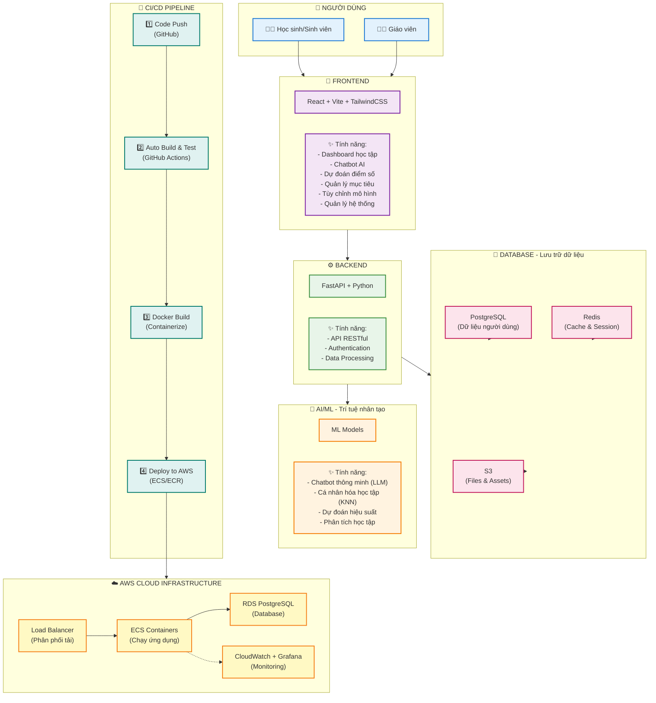

## EduTwin - Bản Sao Học Tập Kỹ Thuật Số
Dự án EduTwin với mục tiêu không chỉ là một nền tảng hỗ trợ học tập thông minh mà còn là một bản sao của bạn trong các vấn đề về học tập, cá nhân hóa trải nghiệm giáo dục cho từng người dùng. Lấy cảm hứng từ sự phát triển của trí tuệ nhân tạo và công nghệ học máy, EduTwin hướng đến việc cung cấp các giải pháp học tập hiện đại, hỗ trợ người học đạt được mục tiêu giáo dục của mình một cách hiệu quả.
Bối cảnh của dự án xuất phát từ nhu cầu ngày càng tăng về các công cụ học tập trực tuyến, đặc biệt là những công cụ có khả năng hiểu và đáp ứng nhu cầu riêng biệt của từng cá nhân. EduTwin với pipeline Machine Learning (ML) tối ưu kết hợp với mô hình ngôn ngữ lớn (LLM) và các kỹ thuật truy xuất không chỉ là ứng dụng đơn thuần mà có khả năng tương tác chủ động - cập nhật dữ liệu trong quá trình sử dụng - tạo nên một vòng tiến hóa liên tục cho hệ thống.
Với sự kết hợp giữa công nghệ tiên tiến và tầm nhìn giáo dục, EduTwin hứa hẹn sẽ trở thành một người bạn đồng hành đáng tin cậy trên hành trình học tập của mỗi cá nhân.

## Tổng quan hệ thống

## Các tính năng chính

### 🎯 1. Dự đoán điểm số thông minh
- **3 thuật toán Machine Learning**: K-Nearest Neighbors (KNN), Kernel Regression (KR), và Locally Weighted Linear Regression (LWLR)
- **Dự đoán đa môn học**: Toán, Văn, Anh, Lý, Hóa, Sinh, Sử, Địa, GDCD
- **Cá nhân hóa mô hình**: Người dùng có thể tùy chỉnh tham số và chọn thuật toán phù hợp
- **Kết quả trực quan**: Hiển thị dự đoán qua biểu đồ và bảng so sánh

### 💬 2. Chatbot AI hỗ trợ học tập
- **Tích hợp Gemini API**: Sử dụng mô hình ngôn ngữ lớn (LLM) để tư vấn học tập
- **Phản hồi thông minh**: Chatbot hiểu ngữ cảnh và cung cấp lời khuyên cá nhân hóa
- **Cập nhật thông tin**: Tự động cập nhật dữ liệu học tập từ cuộc trò chuyện
- **Lịch sử hội thoại**: Lưu trữ và theo dõi các cuộc trò chuyện trước đó

### 📊 3. Dashboard học tập và phân tích
- **Theo dõi tiến độ**: Visualize kết quả học tập qua các biểu đồ (Chart.js, Recharts)
- **Phân tích dataset**: Xem thống kê và phân phối dữ liệu tham chiếu
- **So sánh benchmark**: Đối chiếu điểm số với các học sinh có đặc điểm tương tự
- **Báo cáo chi tiết**: Xuất dữ liệu và phân tích xu hướng học tập

### 🎓 4. Quản lý học tập cá nhân
- **Thiết lập mục tiêu**: Đặt và theo dõi các mục tiêu học tập
- **Cập nhật điểm số**: Nhập và quản lý điểm số các kỳ thi
- **Sở thích học tập**: Cấu hình phong cách và môn học yêu thích
- **Thông tin cá nhân**: Quản lý hồ sơ và thông tin học vụ

### 🔧 5. Công cụ dành cho Developer/Admin
- **Quản lý dataset**: Upload, xem và phân tích dữ liệu huấn luyện
- **Đánh giá mô hình**: Kiểm tra hiệu suất các thuật toán ML với các metrics (MAE, RMSE, R²)
- **Tùy chỉnh mô hình**: Điều chỉnh tham số và so sánh hiệu suất
- **Monitoring**: Theo dõi hệ thống qua Prometheus, Grafana, và Loki

### 🔐 6. Bảo mật và xác thực
- **JWT Authentication**: Đăng nhập an toàn với JSON Web Tokens
- **Mã hóa mật khẩu**: Sử dụng bcrypt với cost factor 12
- **Session management**: Quản lý phiên làm việc qua Redis
- **Role-based access**: Phân quyền người dùng (học sinh, giáo viên, admin)

### 🚀 7. Real-time Updates
- **WebSocket/Socket.IO**: Cập nhật dữ liệu theo thời gian thực
- **Thông báo tức thời**: Nhận thông báo khi có kết quả dự đoán mới
- **Đồng bộ đa thiết bị**: Dữ liệu được đồng bộ tự động

## Công nghệ cốt lõi

### Frontend
- **React 19.2.0**: Thư viện JavaScript hiện đại cho UI
- **Vite 7.2.4**: Build tool siêu nhanh với Hot Module Replacement (HMR)
- **TailwindCSS**: Framework CSS utility-first cho thiết kế responsive
- **React Router 7.9.6**: Quản lý routing trong Single Page Application
- **Axios 1.13.2**: HTTP client cho API calls
- **Chart.js 4.5.1 & Recharts 3.4.1**: Thư viện vẽ biểu đồ tương tác
- **Framer Motion 12.23.24**: Animations và transitions mượt mà
- **Socket.IO Client 4.8.1**: Real-time bidirectional communication
- **React Markdown 10.1.0**: Render Markdown trong chat
- **XLSX 0.18.5**: Xử lý file Excel

### Backend
- **FastAPI**: Web framework hiện đại, nhanh (high-performance) cho Python
- **Uvicorn**: ASGI server để chạy FastAPI
- **SQLAlchemy**: ORM (Object-Relational Mapping) cho Python
- **PostgreSQL 15**: Hệ quản trị cơ sở dữ liệu quan hệ mạnh mẽ
- **Redis 7**: In-memory database cho cache và session
- **Passlib & Bcrypt**: Mã hóa và bảo mật mật khẩu
- **Python-SocketIO**: WebSocket support cho Python
- **HTTPx**: HTTP client async cho Python
- **Python-dotenv**: Quản lý biến môi trường

### Machine Learning & AI
- **Scikit-learn**: Thư viện ML cho Python (KNN, Regression algorithms)
- **Pandas**: Xử lý và phân tích dữ liệu
- **NumPy**: Tính toán số học và mảng đa chiều
- **SciPy**: Hàm toán học và khoa học
- **Gemini API**: Large Language Model cho chatbot AI
- **OpenPyXL**: Đọc/ghi file Excel cho dataset

### DevOps & Infrastructure
- **Docker & Docker Compose**: Containerization và orchestration
- **Nginx**: Web server và reverse proxy (production)
- **GitHub Actions**: CI/CD pipeline tự động
- **AWS Services**:
  - **ECS (Elastic Container Service)**: Chạy Docker containers
  - **ECR (Elastic Container Registry)**: Lưu trữ Docker images
  - **RDS**: PostgreSQL database được quản lý
  - **Load Balancer**: Phân phối traffic và high availability
  - **CloudWatch**: Monitoring và logging

### Monitoring & Observability
- **Prometheus**: Thu thập và lưu trữ metrics
- **Grafana**: Visualization và dashboards
- **Loki**: Log aggregation system
- **Promtail**: Log collection agent
- **Python-JSON-Logger**: Structured logging
- **Prometheus-Client**: Metrics export cho Python
- **Psutil**: System và process utilities

### Development Tools
- **ESLint 9.39.1**: Linting cho JavaScript/React
- **Vite Plugin React**: Fast Refresh cho development
- **Adminer**: Database management UI
- **Git**: Version control system
- **PowerShell Scripts**: Automation cho deployment (AWS) 
## Hướng phát triển
- Tăng cường chi tiết tính năng: Hiện tại mức độ chi tiết của các tác vụ dự đoán đang bị giới hạn bởi tập dữ liệu tham chiếu, nếu có khả năng thu thập các tập dữ liệu chi tiết với các thông tin như:
hoàn cảnh gia đình, môn học năng khiếu, thời gian học, chương trình phụ đạo, khóa học online,... thì sẽ trực đưa ra được các dự đoán chi tiết hơn -> nhiều thông tin hơn -> LLM phản hồi chính xác và chi tiết hơn -> tăng cường cá nhân hóa thông qua việc đưa ra các đề xuấ, phân tích, lộ trình riêng cho từng học sinh.
- Tăng cường tính chuyên môn của hệ thống: Huấn luyện và tự deploy LLM chuyên môn trong tác vụ giáo dục -> tăng cường độ chính xác phản hồi, không phụ thuộc và LLM API của bên thứ 3, tăng cường bảo mật thông tin.
- Tăng cường tính hệ thống và tự động hóa: Kết nối đến các cơ sở dữ liệu của trường/tổ chức để tự động update mỗi khi có dữ liệu mới thay vì nhập thủ công (như SMAS và VNEDU)
