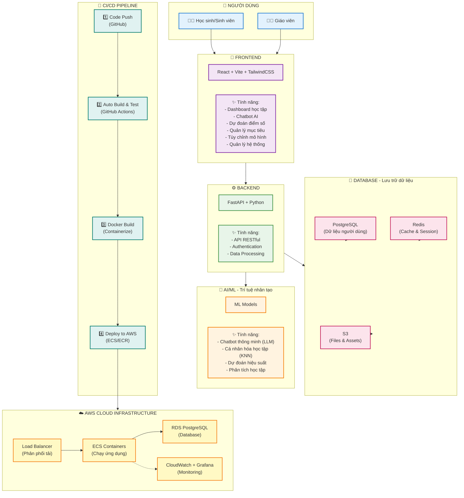

## EduTwin - Bản Sao Học Tập Kỹ Thuật Số
Dự án EduTwin với mục tiêu không chỉ là một nền tảng hỗ trợ học tập thông minh mà còn là một bản sao của bạn trong các vấn đề về học tập, cá nhân hóa trải nghiệm giáo dục cho từng người dùng. Lấy cảm hứng từ sự phát triển của trí tuệ nhân tạo và công nghệ học máy, EduTwin hướng đến việc cung cấp các giải pháp học tập hiện đại, hỗ trợ người học đạt được mục tiêu giáo dục của mình một cách hiệu quả.
Bối cảnh của dự án xuất phát từ nhu cầu ngày càng tăng về các công cụ học tập trực tuyến, đặc biệt là những công cụ có khả năng hiểu và đáp ứng nhu cầu riêng biệt của từng cá nhân. EduTwin với pipeline Machine Learning (ML) tối ưu kết hợp với mô hình ngôn ngữ lớn (LLM) và các kỹ thuật truy xuất không chỉ là ứng dụng đơn thuần mà có khả năng tương tác chủ động - cập nhật dữ liệu trong quá trình sử dụng - tạo nên một vòng tiến hóa liên tục cho hệ thống.
Với sự kết hợp giữa công nghệ tiên tiến và tầm nhìn giáo dục, EduTwin hứa hẹn sẽ trở thành một người bạn đồng hành đáng tin cậy trên hành trình học tập của mỗi cá nhân.

## Tổng quan hệ thống

## Các tính năng chính
1. dự đoán điểm số:
- 3 mô hình Lazy Learning (LL) KNN,Kernel Resgression, LWLR được lựa chọn thay vì các mô hình DL bởi khả năng thích nghi tốt trong bối cảnh giáo dục phức tạp (mỗi trường/trung tâm/sơ sở có các chương trình, môn học khác nhau) -> 3 mô hình LL cho phép thích nghi tốt với input features và ouput labels không cố định, cho phép tạo custom model theo chương trình học của từng học sinh -> tăng tính cá nhân hóa theo đúng muc tiêu EduTwin.

- Trực quan hóa kết quả dự đoán:

- Thiết lập mục tiêu: không chỉ dự đoán truyền thống -> học sinh có thể xác định một mục tiêu tương lai và hệ thống sẽ dự đoán - vẽ lộ trình để đạt mục tiêu -> tính thích nghi của mô hình LL.

- Tự tạo ra các mô hình theo nhu cầu bản thân:

2. Chatbot thông minh - LLM API.
- Giao diện thân thiện, hỗ trợ phân tích cách thông tin học tập. Không chỉ vậy, còn có khả năng trò chuyện chủ động để cuộc trò chuyện như hai người bạn và học tập các thông tin cá nhân hóa -> dùng cho các response và phân tích.

3. Vòng lặp liên tục giúp hệ thống tiến hóa trong quá trình sử dụng.
- Quá trình trò chuyện -> yêu cầu từ người dùng -> intent detection -> xác nhận từ người dùng -> cập nhật vào database -> kích hoạt pipeline ML -> kết quả dự đoán mới -> gửi cho LLM -> response -> yêu cầu từ người dùng.... Đảm bảo thông tin và dự đoán được làm mới liên tục, các thông tin cá nhân cũng được thu thập để hoàn thiện phản hồi của Twin.

4. Phân quyền và quản lý hệ thống.
- Cho phép người dùng role Admin quản lý tập dữ liệu tham chiếu cho LL model, tinh chỉnh tham số, đánh giá mô hình, lựa chọn mô hình được áp dụng -> người quản trị có thể upload tập dữ liệu của trường/cơ sở của mình và lựa chọn mô hình phù hợp -> tăng độ chính xác đối với các dự đoán cho học sinh của trường/cơ sở đó bởi bias của tập dữ liệu tốt hơn.

## Tại sao EduTwin
- So với các hệ thống hỗ trợ giáo dục truyền thống (SMAS - Viettel, VNEDU - VNPT, Google Classroom): chỉ đơn giản là kết nối tới cơ sở dữ liệu cho phép xem kết quả học tập -> EduTwin không chỉ giám sát mà còn dự đoán, phân tích, cá nhân hóa, và tự xây dựng mô hình học tập của riêng bạn.
- So với các mô hình DL: EduTwin linh động, đễ dàng mở rộng và có khả năng custom theo chương trình học, ngoài dự đoán đơn thuần EduTwin còn tích hợp LLM cho phép phân tích, trò chuyện và kết hợp các thông tin cá nhân vào phản hồi.
- So với các AI chatbot (ChatGPT, Gemini,...): bị ảo giác, không lưu trữ khiến mất mát thông tin -> EduTwin lưu trữ thông tin học tập, chuyên biệt cho tác vụ học tập, kết quả và số liệu được tính toán từ hệ thống và kết quả dự đoán của LL model là minh bạch, có thể kiểm chứng.

## Technology Stack
🎨 Frontend
React 19.2.0 – Framework UI chính

Vite 7.2.4 – Build tool & Dev server siêu nhanh

TailwindCSS (Latest) – Utility-first CSS framework

React Router 7.9.6 – Client-side routing

Axios 1.13.2 – HTTP client cho API calls

Chart.js 4.5.1 – Biểu đồ & data visualization

Recharts 3.4.1 – Thư viện biểu đồ cho React

Framer Motion 12.23.24 – Animations & transitions

Socket.IO Client 4.8.1 – Real-time communication

Lucide React 0.554.0 – Icon library

React Markdown 10.1.0 – Render markdown content

⚙️ Backend
FastAPI (Latest) – Python web framework hiện đại

Uvicorn (Latest) – ASGI server

Gunicorn (Latest) – Production WSGI server

SQLAlchemy (Latest) – ORM

Alembic (Latest) – Database migration

Psycopg2 (Latest) – PostgreSQL adapter

Redis (Latest) – Cache & session store

Python Socket.IO (Latest) – WebSocket support

HTTPX (Latest) – Async HTTP client

Pydantic (Latest) – Data validation

🔐 Security & Authentication
Passlib 1.7.4 – Password hashing

Bcrypt 3.2.0 – Encryption algorithm

Cryptography ≥41.0.0 – Mã hóa dữ liệu

AWS KMS (via Boto3) – Key Management Service

Python-dotenv (Latest) – Environment variables

🤖 AI/ML Stack
Scikit-learn (Latest) – Machine Learning (KNN, regression)

Pandas (Latest) – Data manipulation & analysis

NumPy (Latest) – Numerical computing

SciPy (Latest) – Scientific computing

LLM Provider (Custom) – Chatbot AI (OpenAI / Anthropic / Gemini)

AI/ML Features
KNN – Cá nhân hóa học tập

Linear Regression – Dự đoán điểm số

LLM Integration – Chatbot thông minh

Intent Detection – Rule-based NLU với Regex

Performance Analytics – Phân tích học tập

💾 Database & Storage
PostgreSQL – Relational database chính

AWS RDS – Managed PostgreSQL service

Redis – Cache, session storage, rate limiting

AWS S3 – Object storage cho files & assets

🚀 DevOps & Infrastructure
Docker – Containerization

Docker Compose – Local development orchestration

GitHub Actions – CI/CD automation

AWS ECS – Container orchestration

AWS ECR – Docker image registry

AWS Load Balancer – Traffic distribution

Terraform – Infrastructure as Code

Nginx – Reverse proxy & static file serving

📊 Monitoring & Logging
Prometheus – Metrics collection

Grafana – Metrics visualization & dashboards

CloudWatch – AWS native monitoring

Loki – Log aggregation

Promtail – Log shipping to Loki

Python JSON Logger – Structured logging

PSUtil – System metrics

## Khó khăn:
- nguồn lực cá nhân hạn chế khiến:
+ Tập dữ liệu tham chiếu cho LL model bị hạn chế -> giới hạn về phạm vi và độ chi tiết của các dự đoán.
+ Khó xây dựng tập dữ liệu finetune LLM và deploy -> phụ thuộc vào LLM API từ bên thứ 3, các LLM API không chuyên hóa lĩnh vực giáo dục.
## Hướng phát triển
- Tăng cường chi tiết tính năng: Hiện tại mức độ chi tiết của các tác vụ dự đoán đang bị giới hạn bởi tập dữ liệu tham chiếu, nếu có khả năng thu thập các tập dữ liệu chi tiết với các thông tin như:
hoàn cảnh gia đình, môn học năng khiếu, thời gian học, chương trình phụ đạo, khóa học online,... thì sẽ trực đưa ra được các dự đoán chi tiết hơn -> nhiều thông tin hơn -> LLM phản hồi chính xác và chi tiết hơn -> tăng cường cá nhân hóa thông qua việc đưa ra các đề xuấ, phân tích, lộ trình riêng cho từng học sinh.
- Tăng cường tính chuyên môn của hệ thống: Huấn luyện và tự deploy LLM chuyên môn trong tác vụ giáo dục -> tăng cường độ chính xác phản hồi, không phụ thuộc và LLM API của bên thứ 3, tăng cường bảo mật thông tin.
- Tăng cường tính hệ thống và tự động hóa: Kết nối đến các cơ sở dữ liệu của trường/tổ chức để tự động update mỗi khi có dữ liệu mới thay vì nhập thủ công (như SMAS và VNEDU)
